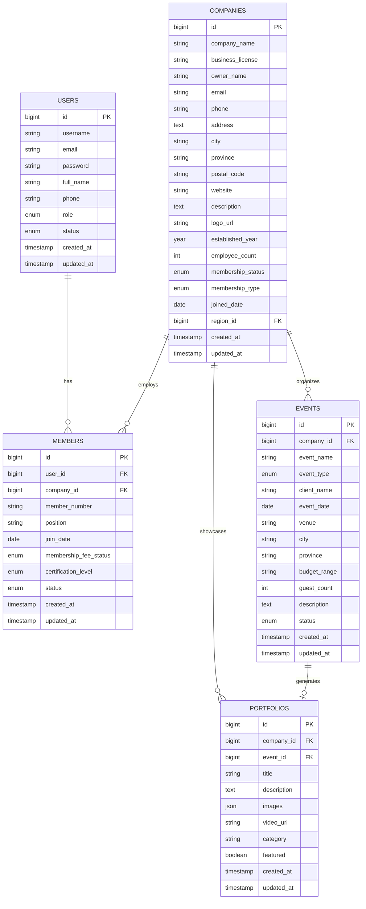

# ERD & Dokumentasi Singkat — HASTANA Indonesia

## Daftar Isi

- [Overview](#overview)
- [Fitur Utama](#fitur-utama)
- [Entity Relationship Diagram (ERD)](#entity-relationship-diagram-erd)
- [Relasi Antar Entitas](#relasi-antar-entitas)
- [Database Schema](#database-schema)
- [API Documentation](#api-documentation)
- [Installation Guide](#installation-guide)
- [User Manual](#user-manual)
- [Developer Guide](#developer-guide)
- [Support & Contact](#support--contact)
- [License](#license)

## Overview

HASTANA (Himpunan Perusahaan Penata Acara Indonesia) adalah organisasi yang menaungi wedding organizer profesional di seluruh Indonesia. Sistem web aplikasi ini dirancang untuk:

- Mengelola keanggotaan perusahaan wedding organizer
- Menyediakan platform showcase portfolio
- Menyelenggarakan program sertifikasi dan pelatihan
- Memfasilitasi networking antar anggota
- Memberikan direktori lengkap wedding organizer Indonesia

## Fitur Utama

### Manajemen Keanggotaan

- Pendaftaran dan verifikasi anggota
- Sistem membership bertingkat (Regular, Premium, Platinum)
- Tracking iuran keanggotaan

### Portfolio Management

- Showcase karya wedding organizer
- Galeri foto dan video
- Kategorisasi berdasarkan jenis acara

### Sistem Sertifikasi & Pelatihan

- Program sertifikasi bertingkat
- Tracking kompetensi anggota
- Workshop dan training

### Direktori Perusahaan & Informasi

- Database wedding organizer
- Filter berdasarkan lokasi dan layanan
- Portal berita / event / pengumuman

## Entity Relationship Diagram (ERD)



## Relasi Antar Entitas

| Relasi | Kardinalitas | Deskripsi |
|---|---:|---|
| USERS → MEMBERS | 1 : N | Satu user bisa menjadi member di beberapa perusahaan |
| COMPANIES → MEMBERS | 1 : N | Satu perusahaan memiliki banyak member |
| COMPANIES → EVENTS | 1 : N | Satu perusahaan menghandle banyak event |
| COMPANIES → PORTFOLIOS | 1 : N | Satu perusahaan memiliki banyak portfolio |
| EVENTS → PORTFOLIOS | 1 : 1 / 1 : N | Satu event dapat menghasilkan portfolio |
| MEMBERS → CERTIFICATIONS | N : N | Member bisa memiliki banyak sertifikat (via tabel pivot) |
| TRAINING_PROGRAMS → MEMBERS | N : N | Program training diikuti banyak member (via tabel pivot) |

## Database Schema

### users

```sql
CREATE TABLE users (
  id BIGINT UNSIGNED AUTO_INCREMENT PRIMARY KEY,
  username VARCHAR(255) UNIQUE NOT NULL,
  email VARCHAR(255) UNIQUE NOT NULL,
  email_verified_at TIMESTAMP NULL,
  password VARCHAR(255) NOT NULL,
  full_name VARCHAR(255) NOT NULL,
  phone VARCHAR(255) NULL,
  role ENUM('admin', 'member', 'guest') DEFAULT 'guest',
  status ENUM('active', 'inactive') DEFAULT 'active',
  remember_token VARCHAR(100) NULL,
  created_at TIMESTAMP NULL,
  updated_at TIMESTAMP NULL
);
```

### companies

```sql
CREATE TABLE companies (
  id BIGINT UNSIGNED AUTO_INCREMENT PRIMARY KEY,
  company_name VARCHAR(255) NOT NULL,
  business_license VARCHAR(255) UNIQUE NOT NULL,
  owner_name VARCHAR(255) NOT NULL,
  email VARCHAR(255) UNIQUE NOT NULL,
  phone VARCHAR(255) NOT NULL,
  address TEXT NOT NULL,
  city VARCHAR(255) NOT NULL,
  province VARCHAR(255) NOT NULL,
  postal_code VARCHAR(255) NOT NULL,
  website VARCHAR(255) NULL,
  description TEXT NULL,
  logo_url VARCHAR(255) NULL,
  established_year YEAR NULL,
  employee_count INT NULL,
  membership_status ENUM('active', 'pending', 'suspended') DEFAULT 'pending',
  membership_type ENUM('regular', 'premium', 'platinum') DEFAULT 'regular',
  joined_date DATE NULL,
  region_id BIGINT UNSIGNED NULL,
  created_at TIMESTAMP NULL,
  updated_at TIMESTAMP NULL,
  FOREIGN KEY (region_id) REFERENCES regions(id) ON DELETE SET NULL
);
```

### members

```sql
CREATE TABLE members (
  id BIGINT UNSIGNED AUTO_INCREMENT PRIMARY KEY,
  user_id BIGINT UNSIGNED NOT NULL,
  company_id BIGINT UNSIGNED NOT NULL,
  member_number VARCHAR(255) UNIQUE NOT NULL,
  position VARCHAR(255) NOT NULL,
  join_date DATE NOT NULL,
  membership_fee_status ENUM('paid', 'pending', 'overdue') DEFAULT 'pending',
  certification_level ENUM('basic', 'intermediate', 'advanced', 'expert') NULL,
  status ENUM('active', 'inactive') DEFAULT 'active',
  created_at TIMESTAMP NULL,
  updated_at TIMESTAMP NULL,
  FOREIGN KEY (user_id) REFERENCES users(id) ON DELETE CASCADE,
  FOREIGN KEY (company_id) REFERENCES companies(id) ON DELETE CASCADE
);
```

### Indeks dan Constraints

```sql
CREATE INDEX idx_companies_city ON companies(city);
CREATE INDEX idx_companies_province ON companies(province);
CREATE INDEX idx_events_date ON events(event_date);
CREATE INDEX idx_members_status ON members(status);
CREATE INDEX idx_portfolios_featured ON portfolios(featured);

ALTER TABLE companies ADD CONSTRAINT uk_companies_email UNIQUE (email);
ALTER TABLE companies ADD CONSTRAINT uk_companies_license UNIQUE (business_license);
ALTER TABLE members ADD CONSTRAINT uk_members_number UNIQUE (member_number);
```

## API Documentation

### Authentication

#### POST /api/auth/register

Request body:

```json
{
  "username": "john_doe",
  "email": "john@example.com",
  "password": "password123",
  "full_name": "John Doe",
  "phone": "081234567890"
}
```

Response:

```json
{
  "status": "success",
  "message": "User registered successfully",
  "data": {
    "user": {
      "id": 1,
      "username": "john_doe",
      "email": "john@example.com",
      "full_name": "John Doe"
    },
    "token": "..."
  }
}
```

#### POST /api/auth/login

Request body:

```json
{
  "email": "john@example.com",
  "password": "password123"
}
```

### Company

#### GET /api/companies

Query params:

- page (default: 1)
- per_page (default: 15)
- city
- province
- membership_type

#### POST /api/companies

Request body:

```json
{
  "company_name": "Dream Wedding Organizer",
  "business_license": "123456789",
  "owner_name": "Jane Smith",
  "email": "info@dreamwedding.com",
  "phone": "021-12345678",
  "address": "Jl. Sudirman No. 123",
  "city": "Jakarta",
  "province": "DKI Jakarta",
  "postal_code": "12345",
  "website": "https://dreamwedding.com",
  "description": "Wedding organizer profesional dengan pengalaman 10 tahun"
}
```

## Installation Guide

### System Requirements

- PHP >= 8.1
- Composer >= 2.0
- MySQL >= 8.0 / MariaDB >= 10.3
- Node.js >= 16
- NPM >= 8

### Setup Lokal (Development)

```bash
composer install
npm install

cp .env.example .env
php artisan key:generate

php artisan migrate
php artisan db:seed
php artisan storage:link

npm run dev
php artisan serve
```

### Deployment (ringkas)

```bash
composer install --optimize-autoloader --no-dev
php artisan config:cache
php artisan route:cache
php artisan view:cache
```

## User Manual

### Admin Organisasi

- Dashboard: statistik, grafik pertumbuhan, aktivitas terbaru, notifikasi
- Manajemen perusahaan: verifikasi, status membership, upgrade membership
- Manajemen member: daftar member, sertifikasi, tracking iuran
- Program pelatihan: buat program, kelola peserta, sertifikat

### Perusahaan Wedding Organizer

- Profil perusahaan & ringkasan aktivitas
- Portfolio: upload, edit, kategorisasi, featured
- Event: input event, timeline, client management, budget tracking
- Team: undang member, role assignment

### Member/Karyawan

- Profil, sertifikasi, riwayat training
- Daftar training, registrasi, progress tracking, download sertifikat

## Developer Guide

### Struktur Proyek (ringkas)

```text
app/
  Models/
  Filament/
  Http/
database/
resources/
routes/
```

### Coding Standards (ringkas)

- PSR-1, PSR-4, PSR-12
- Naming:
  - Class: PascalCase
  - Method/variable: camelCase
  - Table/column: snake_case

### Testing

```bash
php artisan test
php artisan test --filter CompanyTest
php artisan test --coverage
```

## Support & Contact

- Email: tech-support@hastana-indonesia.org
- Phone: +62-21-1234-5678
- WhatsApp: +62-812-3456-7890

## License

Copyright © 2024 HASTANA Indonesia. All rights reserved.

Dokumentasi versi 1.0.0 — Terakhir diperbarui: Januari 2024
